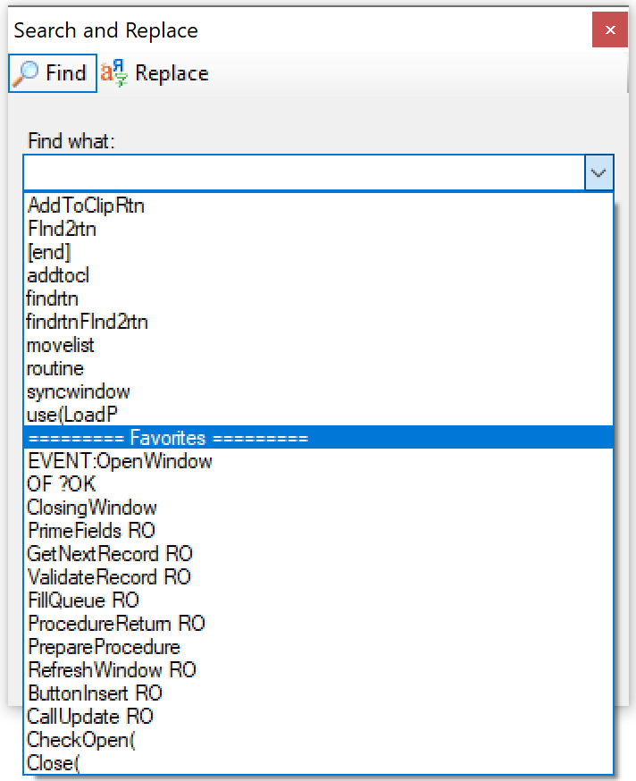
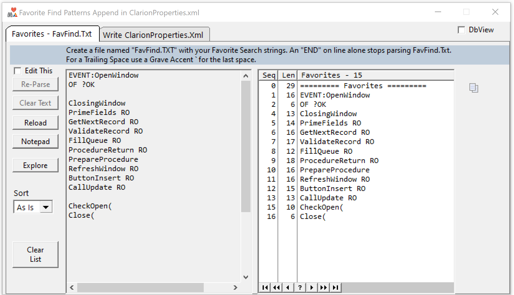
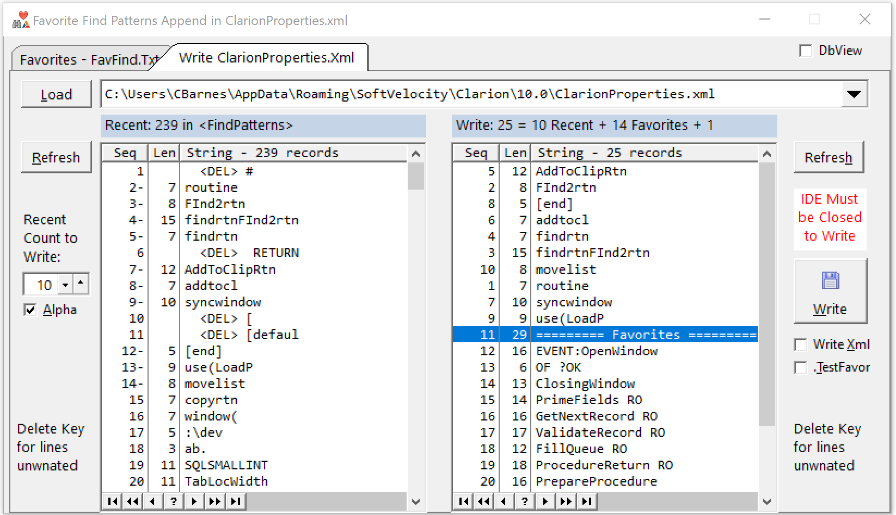

# FavoriteFind ... aka Clean Part Duex?

The Clarion Find dialog drop list retains strings forever causing it to grow to 1000's. "Find Clean CW IDE" fixed that problem by shrinking the list down to the most recent 20. I almost never drop the list and use those.

FavoriteFind lets you specify your "favorite strings" to add to the drop list. You could use this to add strings you search most often, or strings that are long to type, or strings you have trouble remembering. If you had complicated Wild or Regular Expressions you could add them to this list.

This tool is not fully finished and is a bit ugly. It works just fine, I use it every morning. I want to finalize the features then make this part of Find Clean. Please post any suggestions in the Clarion Hub thread.

## How to Use Favorite Find

Use Notepad to setup a text file named FavFind.TXT with your list of favorite strings defined one per line. This is simple to edit anytime you are working and realize you want to add to your list. 

When you run Favorite Find the first tab below displays showing the FavFind.txt on the left and the parsed sorted list on the right, You can make test edits here or delete favorites from the list.

On this tab select the Clarion Version from the drop list at the top to load the XML file. The most recent finds are loaded into the list on the Left. Select the count of recent searches to write in the shrunk file. Check the "Alpha" box to sort them by A-Z.

On the Right is the Merged List with Recent searches at the top and favorites at the bottom. Select any you don't want and press the Delete key. When you like the list press the Write button. The original Xml file is saved as .Xml.b4favor.

## How to Build Favorite Find

The project and source file are in the parent directory. This folder exists on GitHub to have a separate ReadMe. Open FavoriteFind.CwProj and build it.