# FindCleanCwIDE 

In short ... run this utility once a month to keep the Find dialog opening fast and the drop list in MRU order.

The Editor Find dialog saves your search strings to feed the drop list for reuse. 
 The ClarionProperties.XML file stores these strings in `<FindPatterns value=""/>`.
 This is NEVER purged :( so it can grow very large with 1000's of entries that cause the dialog to open slowly.
 This utility will shrink it to fix the problem.
 The About tab has more informaton. Also read the ClarionHub thread: [FIND popup dialog window appears slowly in IDE](https://clarionhub.com/t/find-popup-dialog-window-appears-slowly-in-ide/3764)

Below is the main window where you set your Max and Min counts then press Query to view the count of Find and Replace patterns.
 Pressing the Shrink button will actually write the files. The Clarion IDE must be closed.
 The example shows Clarion 11 with Find Patterns having 453 items taking 5301 bytes.
 Are you going to search a drop list with 453 items?
 Click Shrink to reduce it to 25 items and 243 bytes.
 I've had systems with 9000 items taking 125k.

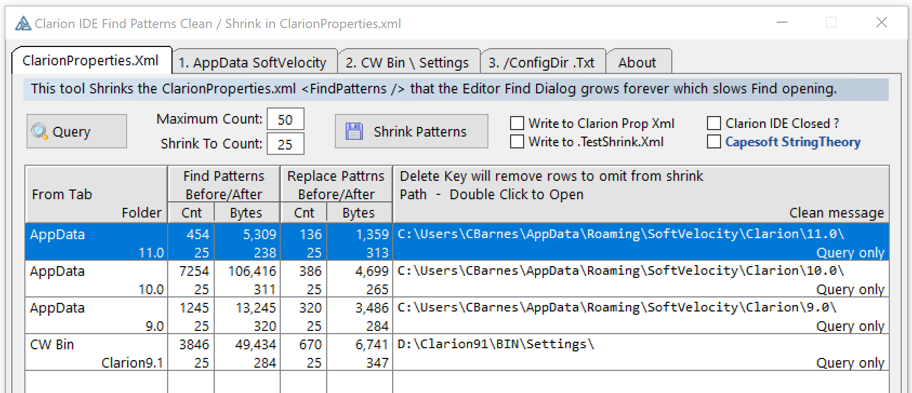

The AppData folders are the normal location of ClarionProperties.XML. This tab shows the contents of these folders.

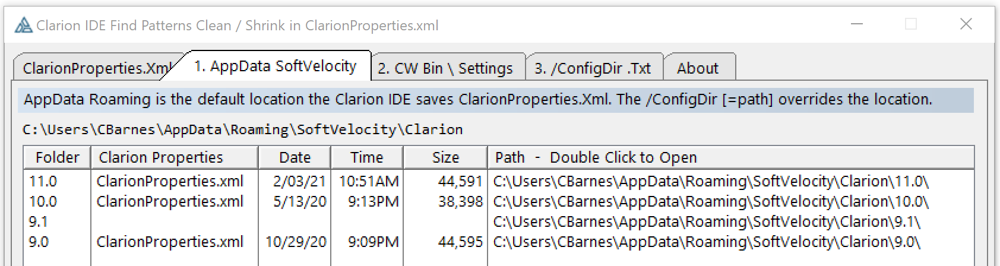

This tab shows the Clarion installs from the Registry.
 If the /ConfigDir switch was used these can have a Bin\Settings folder with ClarionProperties.XML.
 Don't worry if you don't know about /ConfigDir. It is rarely used, just ignore it.

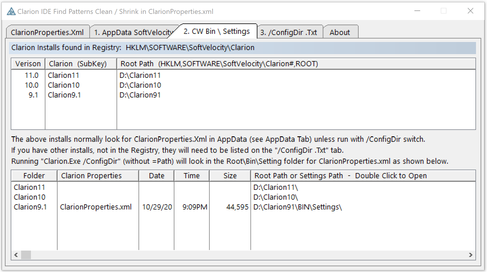

The Config tab is where you can list folders you use with the  Clarion.exe /ConfigDir= switch. 
 In the below example I am using it to load test files from other folders.
 
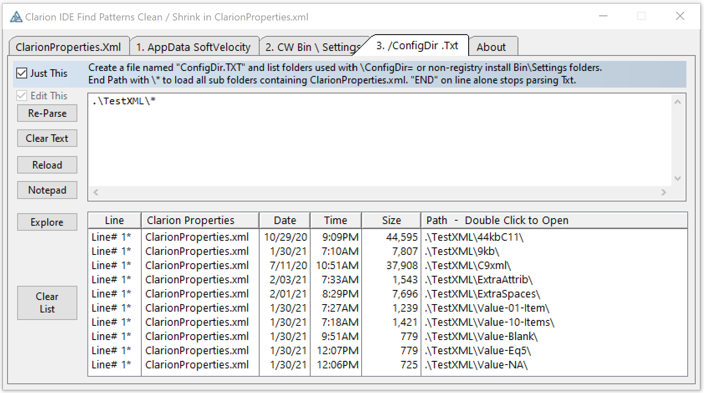

One reason I wrote this is I thought it might be useful to have code to find all the Clarion Installs and Configurations.
 If you use code in this repo Please let me know how you used it?

## Big Bang Class for StringTheory

This code contains an example of using my Big Bang Theory class to show a StringTheory call result string or queue in a Window.
 BBT lets you visually confirm your ST code is getting the desired results.

The FindCleanCwIDE_ST.clw module contains all the ST code. Look in there for calls to BangCls.
 For the Bang windows to display the BangView variable must be (1).
 At runtime you can stop the display of the windows by checking "No Bang".

In the below screen capture you see the call to st.FindMatchPosition() then
 the call to BangCls.StringView() will display the slice in a Window.
 There are many other screen captures of the steps of this process.
 E.g. at the bottom you can see a List view of the split lines queue.

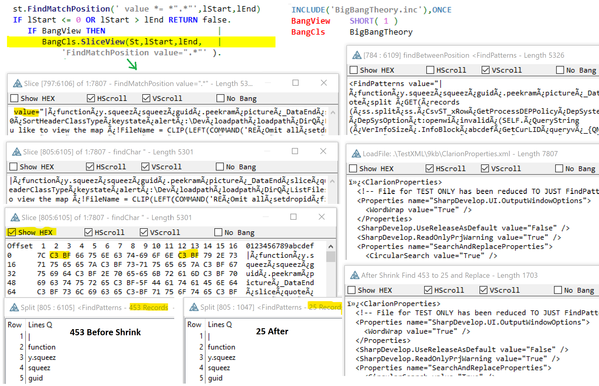

https://github.com/CarlTBarnes/StringTheory-LoadFile-Split-Viewer

## Window Preview Class

To show the many features of my Window Preview class I added it to Find Clean.
 It's accessed with the "secret" flat button in top left corner, just hover up there and it will pop up.
 It opens a new widow showing all controls on the Window in a List.
 You can examine PROP's of Controls, Window and SYSTEM. You can resize and restyle controls.
 For a LIST you can view the Format(), all the PROPLIST for one column and the Styles.
 You can see the From Queue design and record data. 
 You can "Re-Format" the LIST i.e. change the FORMAT string, e.g. to resize columns.
 
Don't think too hard about it, just click the secret top left button and look at everything, click every button and double on every row.
 All this from 3 lines of code to Include, Declare and Init() my WndPreview class. 

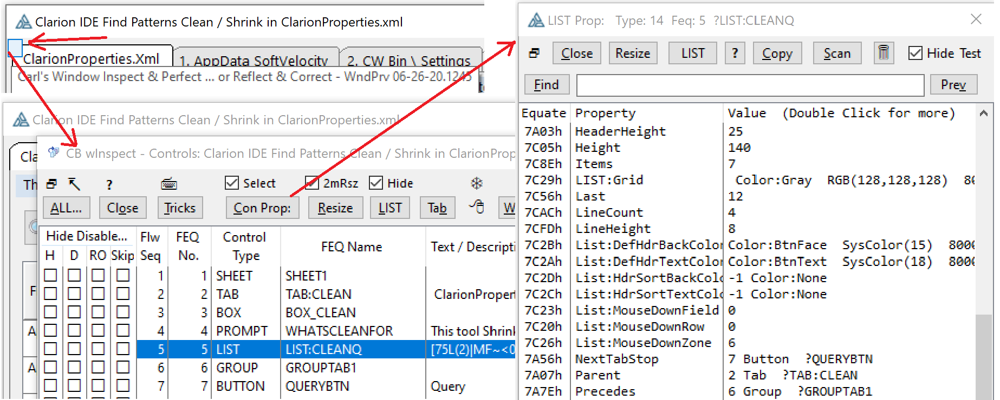

Below is a capture of the "Resizer". It also allows changing many other properties like Font and Colors.
 Below I'm resizing the List by setting the number of Items so it has no partial rows. I also bumped up the line height to 9.
  So 5 items and 9 line height works out to a List height of 118. This is done on the live window so is perfect. 
 
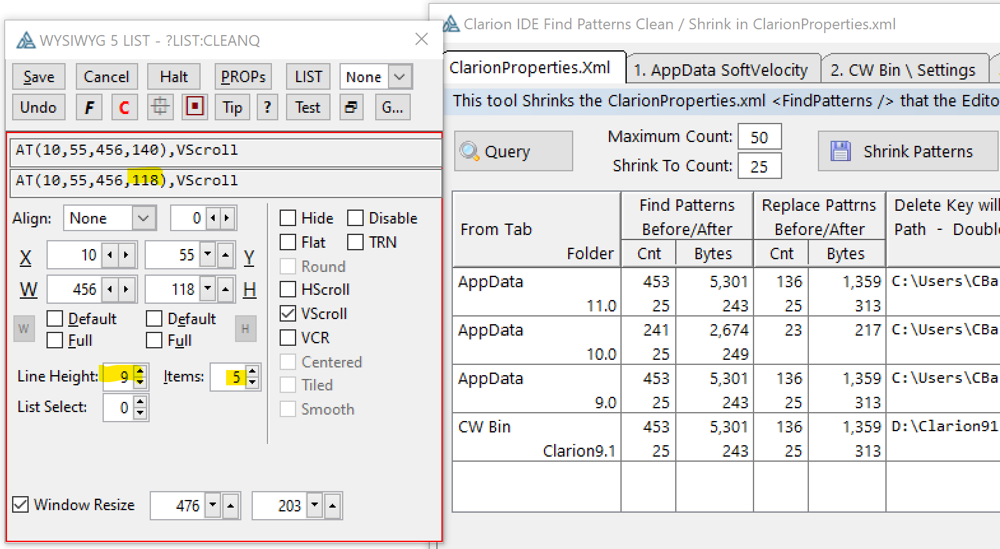

The LIST button shows the Format() split into lines so you can see the many attributes in columns.
 E.g. it can be handy to see all the pictures in one column.

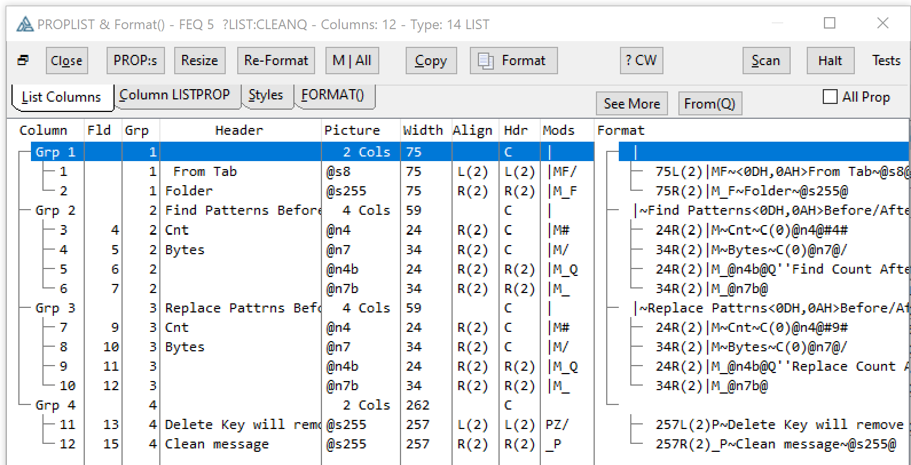

Double click on a column above and it shows all the PROPLIST for that single column. There is also a Styles tab, this column uses Style Z(1) that only defined a Consolas font.

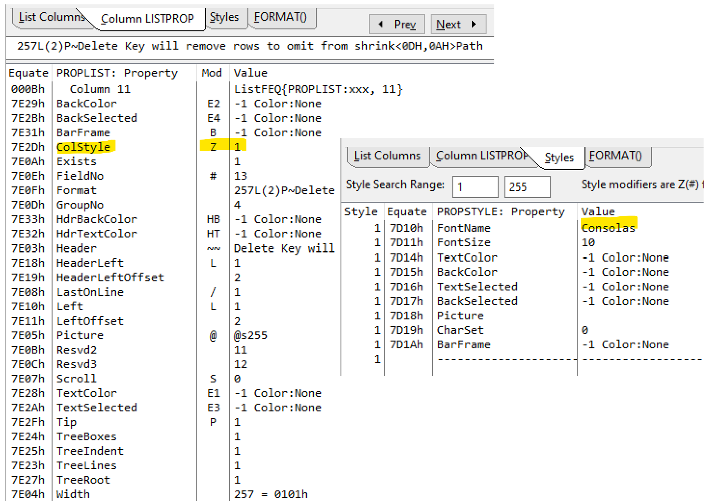

The FromQ tab shows the Declaration the the Queue feeding the List. It shows the values of the current record.
 It shows Queue fields not visible in the List.

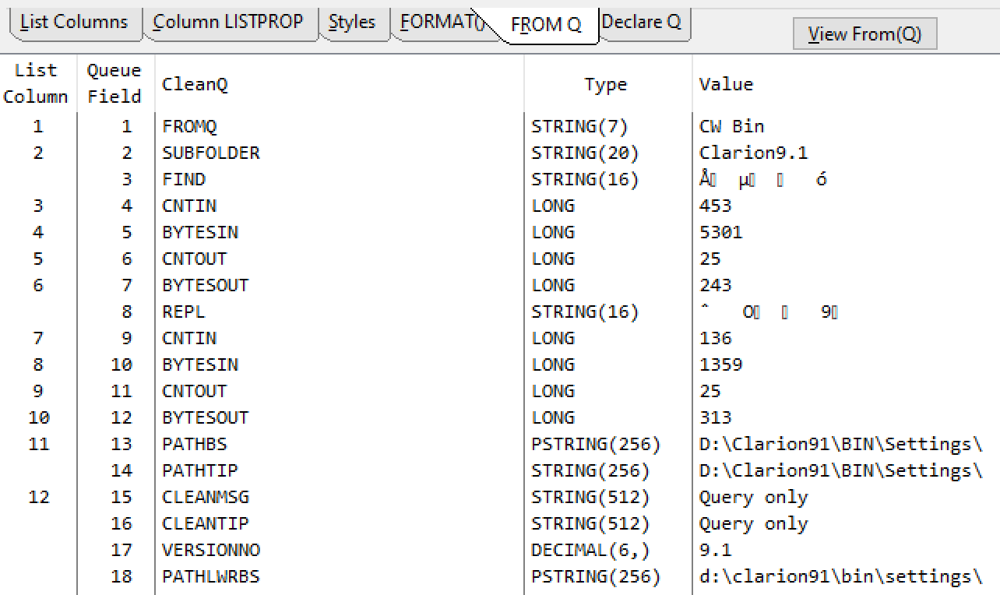

The View Queue button shows the records in the Queue. You delete or add records. You can copy them to the clipboard.
 This lets you see Queue fields not visible in the Lists, e.g. the color or style Longs.

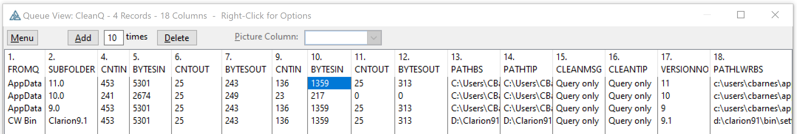

The Re-Format lets you change the columns in a List and see it live. This can be useful for sizing columns to actual data.
 Below I have changed the picture from T3 to T1 which allowed reducing the width from 34 to 23. I also checked Underline.

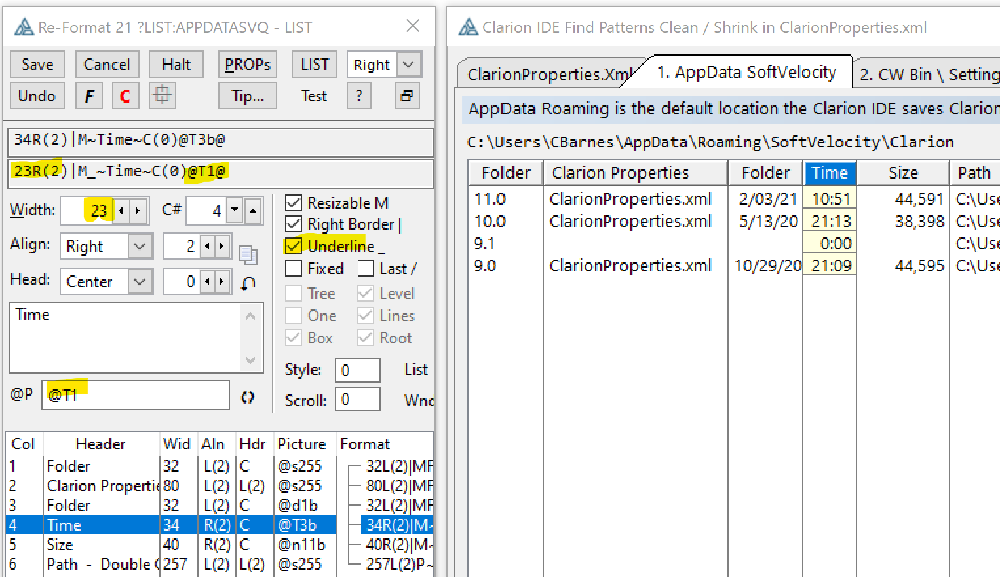

https://github.com/CarlTBarnes/WindowPreview
